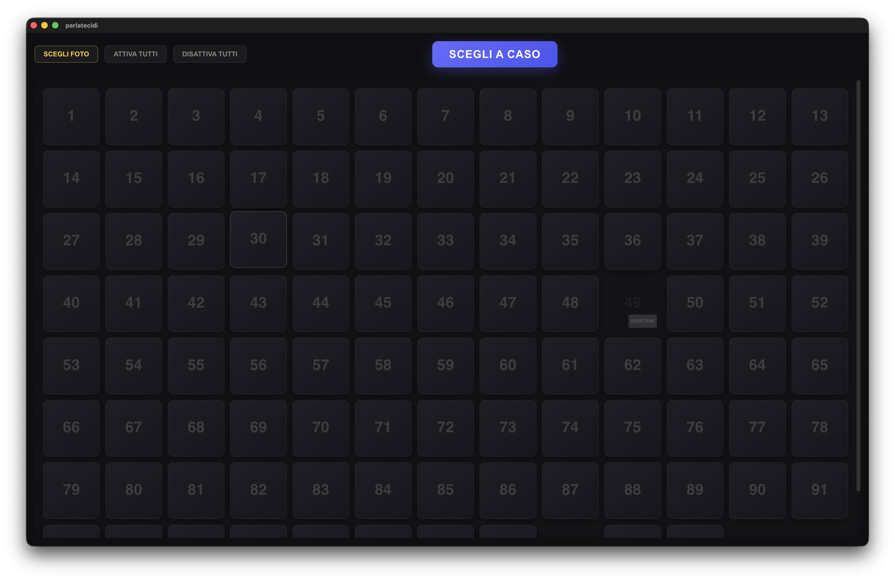
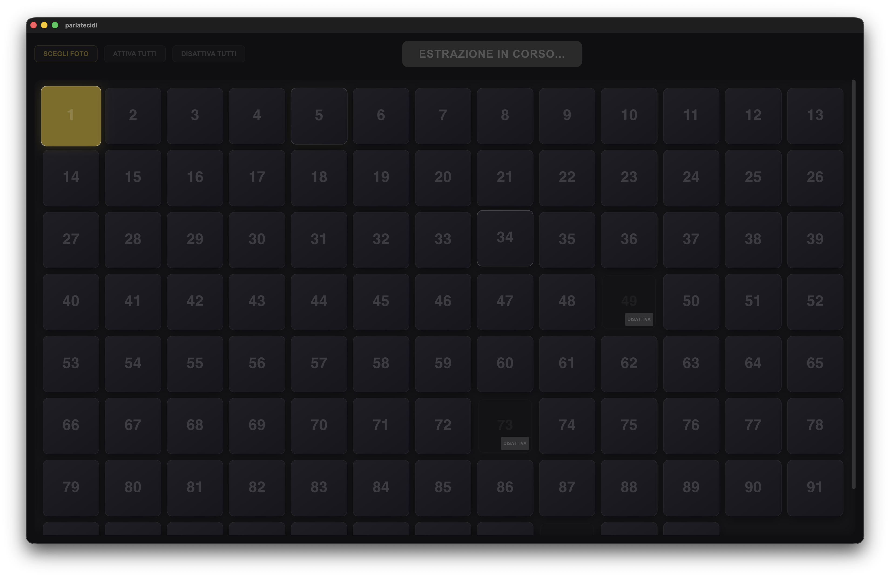
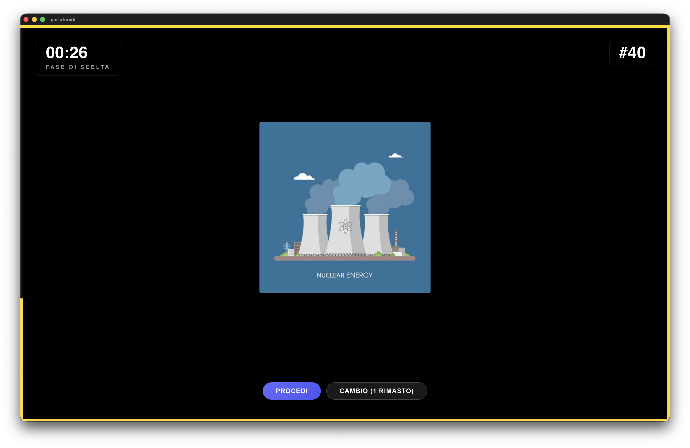
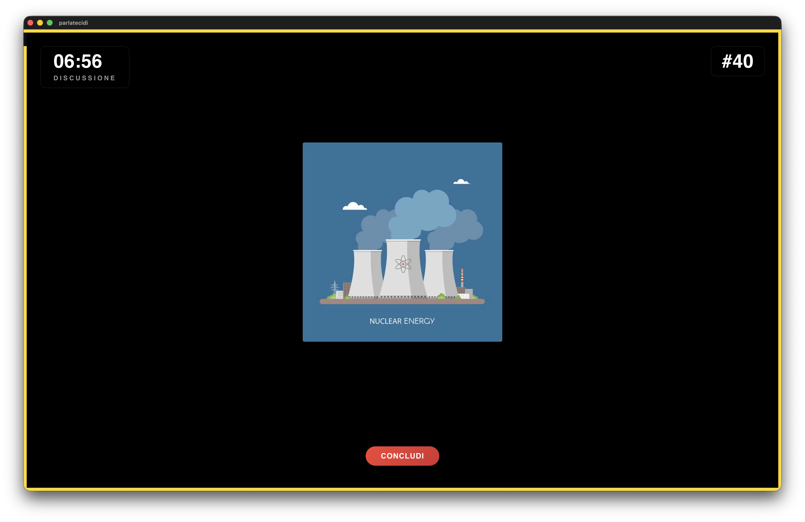
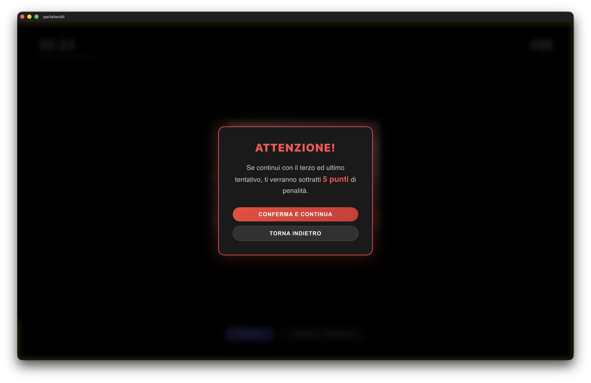

# 🎤 ParlateCiDi - OCT


**ParlateCiDi** è un'applicazione desktop progettata e utilizzata per supportare lo svolgimento della prova **"Parlateci di..."** durante le fasi finali delle **Olimpiadi della Cultura e del Talento (OCT)**, un prestigioso concorso scolastico rivolto agli studenti delle scuole secondarie di secondo grado.

Questa applicazione mira a semplificare l'estrazione degli stimoli visivi (fotografie), gestire le tempistiche della prova e tenere traccia delle diverse fasi dell'esposizione (scelta, lingua inglese, discussione).

---

#### 📸 Screenshot

| Home Page - Griglia Foto | Estrazione in corso | Fase di Scelta |
| :---: | :---: | :---: |
|  |  |  |

| Fase di Discussione | Warning Penalità |
| :---: | :---: |
|  |  |

---

> [!WARNING]
> **Copyright & Licenza:** Questo software è protetto da diritto d'autore (All Rights Reserved). Non è consentita la copia, distribuzione, modifica, o alcun uso commerciale o personale del codice senza esplicita autorizzazione. Il codice è pubblico esclusivamente a scopo di visualizzazione.

> [!IMPORTANT]
> **Stato del Progetto:** L'applicazione è stata utilizzata attivamente con successo per la prova "Parlateci di..." delle Olimpiadi della Cultura e del Talento. Per info sull'iter delle competizioni, consultare i canali ufficiali.

---

#### 🔗 Link Utili
* **Sito Ufficiale OCT:** [olimpiadidellacultura.it](https://www.olimpiadidellacultura.it/)
* **Repository:** [RMChannel/Parlateci-Di-OCT](https://github.com/RMChannel/Parlateci-Di-OCT)

---

#### 📑 Indice
*   [🏆 La Prova "Parlateci di..."](#-la-prova-parlateci-di)
*   [💻 Come Funziona il Progetto (Codice)](#-come-funziona-il-progetto-codice)
*   [🛠 Tech Stack](#-tech-stack)
*   [⚙️ Pipeline CI/CD: Rilasci Automatici](#️-pipeline-cicd-rilasci-automatici)
*   [☕ Sviluppo Locale](#-sviluppo-locale)

---

#### 🏆 La Prova "Parlateci di..."

"Parlateci di..." è una delle prove più iconiche delle Olimpiadi della Cultura e del Talento. 
Ai concorrenti viene richiesto di improvvisare e strutturare un discorso partendo da uno stimolo visivo (una foto) estratto sul momento.

**Come funziona la prova (e l'applicazione):**

1. **Fase di Scelta (Estrazione):** Il team estrae casualmente una fotografia. 
2. **Cambi Consentiti:** I ragazzi hanno la possibilità di "cambiare" la foto estratta se la ritengono troppo difficile, per un massimo di due volte. Se decidono di usufruire del terzo e ultimo tentativo (secondo cambio), subiscono una penalità di **-5 punti** sul punteggio finale della prova.
3. **Parte in Inglese (English Phase):** La prima parte dell'esposizione richiede agli studenti di parlare esclusivamente in lingua inglese. Per questa fase l'applicazione fa partire un timer dedicato (solitamente di 60 secondi, o meno a seconda dei cambi effettuati).
4. **Discussione (Discussion Phase):** Terminato il tempo per la parte in inglese, inizia la discussione generale in italiano. L'applicazione avvia il timer finale (generalmente 7 minuti) entro il quale la squadra deve esaurire la propria esposizione analizzando la foto da diverse prospettive.

---

#### 💻 Come Funziona il Progetto (Codice)

Il progetto è una **Single Page Application (SPA)** sviluppata in React che "gira" all'interno di una finestra del sistema operativo grazie ad Electron.

Le funzionalità principali (gestite principalmente nel file `App.jsx`) includono:
*   **Gestione dello Stato Globale:** L'applicazione legge le immagini contenute in una cartella locale (`foto/`). Lo stato delle immagini (attiva/disattiva per evitare doppie estrazioni) viene mantenuto in modo persistente utilizzando `electron-store`.
*   **Estrazione Casuale (Shuffle):** Un algoritmo di roulette simula visivamente l'estrazione della fotografia, mostrando le foto scorrere prima di fermarsi su una selezione casuale.
*   **Macchina a Stati per le Fasi:** L'UI è gestita in fasi distinte (`CHOICE`, `ENGLISH`, `DISCUSSION`, `CLOSED`). Ogni transizione regola in automatico i timer e abilita i pulsanti d'azione (come i cambi foto con i relativi malus).
*   **Timer Grafico e di Sistema:** È implementato un timer adattivo e visivamente reattivo che utilizza SVG animati per mostrare graficamente lo scorrere del tempo per ogni fase dell'esposizione.

---

#### 🛠 Tech Stack

L'intero software è progettato per essere leggero, multipiattaforma e veloce.

*   **[React 19](https://react.dev/):** Utilizzato per la creazione dell'Interfaccia Utente (UI) e la gestione reattiva dello stato (hooks, functional components).
*   **[Vite 6](https://vitejs.dev/):** Scelto come bundler e dev-server. Garantisce tempi di build estremamente rapidi e un'esperienza di sviluppo locale immediata grazie all'Hot Module Replacement (HMR).
*   **[Electron 41](https://www.electronjs.org/):** Framework utilizzato per "impacchettare" l'applicazione web rendendola un'app Desktop nativa con accesso al file system (es. lettura della cartella delle foto in locale).
*   **CSS3 (Vanilla):** Tutto lo styling è gestito con CSS puro, focalizzandosi su variabili (`var()`) e transizioni per le animazioni del timer e delle foto.

---

#### ⚙️ Pipeline CI/CD: Rilasci Automatici

Il progetto include una robusta pipeline di **Continuous Integration e Continuous Deployment (CI/CD)** basata su **GitHub Actions**. Questa automazione si occupa di generare in autonomia i file eseguibili per i diversi Sistemi Operativi ogni volta che avviene una modifica al branch principale.

Il flusso di lavoro, definito nel file `.github/workflows/build-and-release.yml`, prevede:
1. **Bump della Versione:** Alla push sul branch `main`, uno script incrementa automaticamente la versione in `package.json` (es. `1.0.0` -> `1.0.1`) e crea un nuovo Tag Git.
2. **Matrice di Build:** GitHub Actions avvia in parallelo tre macchine virtuali (`ubuntu-latest`, `windows-latest`, `macos-latest`).
3. **Compilazione & Packaging:** Su ogni macchina vengono installate le dipendenze, l'app React viene compilata tramite Vite, e successivamente **`electron-builder`** si occupa di generare gli installer (`.exe`, `.dmg`, `.AppImage`).
4. **Auto-Release:** Gli eseguibili generati vengono automaticamente caricati come "Release" pubblica nel repository GitHub, pronti per essere scaricati e utilizzati dalla giuria.

---

#### ☕ Sviluppo Locale

Se vuoi esplorare o modificare il progetto in locale:

**Requisiti:**
*   [Node.js](https://nodejs.org/) installato.
*   npm o un altro package manager.

**Passaggi:**
1. Installa le dipendenze:
   ```bash
   npm install
   ```
2. Avvia in modalità sviluppo (React + Electron):
   ```bash
   npm run electron:dev
   ```
3. Compila per il tuo OS:
   ```bash
   npm run electron:build
   ```

> [!WARNING]
> **Nota per macOS:** Essendo l'app compilata senza la firma a pagamento (*Apple Developer ID*), macOS mostrerà un errore di quarantena al primo avvio ("App danneggiata"). Per risolverlo, basta aprire il Terminale ed eseguire: `xattr -cr /Applications/ParlateCiDi.app`.
